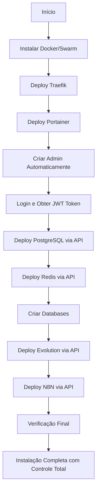

# 🚀 SetupAlicia Professional - Controle Total via Portainer

## 🎯 O Problema Resolvido

Ao deployar stacks via `docker stack deploy` antes do Portainer estar configurado, as stacks ficam com controle "Limited" no Portainer, impossibilitando:
- ❌ Edição de configurações
- ❌ Visualização completa de logs
- ❌ Gerenciamento via interface
- ❌ Backup facilitado
- ❌ Redeploy com alterações

## ✨ A Solução Professional

A versão Professional resolve isso deployando todas as stacks **através da API do Portainer**, garantindo:
- ✅ **Controle TOTAL** de todas as stacks
- ✅ **Edição completa** via interface
- ✅ **Logs centralizados** 
- ✅ **Backup e migração** simplificados
- ✅ **Redeploy facilitado**
- ✅ **Variáveis de ambiente** editáveis

## 📦 Arquivos da Versão Professional

### 1. `instalacao_profissional.sh`
Script principal com fluxo otimizado:
1. Instala Traefik (necessário para SSL)
2. Instala Portainer
3. Cria conta admin automaticamente
4. Faz login e obtém token JWT
5. Deploya todas as outras stacks via API

### 2. `portainer_stack_manager.sh`
Biblioteca de funções para gerenciar stacks:
- Login e autenticação JWT
- Deploy de stacks via API
- Gerenciamento de endpoints
- Remoção de stacks antigas

### 3. `portainer_auto_setup.sh`
Funções para configuração automática do Portainer:
- Criação de conta admin
- Configuração de endpoints
- Validações de segurança

## 🚀 Como Usar

### Instalação Rápida (Professional)
```bash
bash <(curl -sSL https://raw.githubusercontent.com/lonardonetto/setupalicia/main/instalacao_profissional.sh) \
"seu@email.com" \
"editor.seudominio.com" \
"painel.seudominio.com" \
"webhook.seudominio.com" \
"evo.seudominio.com"
```

### Instalação com Menu Interativo
```bash
bash <(curl -sSL https://raw.githubusercontent.com/lonardonetto/setupalicia/main/instalacao_profissional.sh)
```

## 🔄 Fluxo de Deploy Professional



## 🔐 APIs do Portainer Utilizadas

### Autenticação
```bash
POST /api/auth
# Retorna JWT token para operações subsequentes
```

### Gerenciamento de Stacks
```bash
POST /api/stacks?type=1&method=string&endpointId={id}
# Deploy de nova stack com controle total
```

### Endpoints
```bash
GET /api/endpoints
POST /api/endpoints
# Gerenciamento de endpoints Docker/Swarm
```

## 📊 Comparação: Standard vs Professional

| Recurso | Standard | Professional |
|---------|----------|--------------|
| Instalação automática | ✅ | ✅ |
| SSL automático | ✅ | ✅ |
| Criação admin Portainer | ✅ | ✅ |
| Controle das stacks | ❌ Limited | ✅ Full Control |
| Edição via Portainer | ❌ | ✅ |
| Logs completos | ❌ | ✅ |
| Backup facilitado | ❌ | ✅ |
| Redeploy com mudanças | ❌ | ✅ |
| Variáveis editáveis | ❌ | ✅ |
| Deploy via API | ❌ | ✅ |

## 🎯 Vantagens da Versão Professional

### 1. **Controle Total**
Todas as stacks são gerenciadas completamente pelo Portainer, permitindo operações avançadas.

### 2. **Edição Facilitada**
Altere configurações, variáveis de ambiente e recursos diretamente na interface.

### 3. **Logs Centralizados**
Visualize logs de todos os containers em um único lugar.

### 4. **Backup Simplificado**
Exporte e importe stacks facilmente para backup ou migração.

### 5. **Scaling Dinâmico**
Ajuste o número de réplicas diretamente no Portainer.

### 6. **Monitoramento Integrado**
Métricas e estatísticas disponíveis na interface.

## 🔧 Requisitos Técnicos

### Sistema
- Ubuntu 18.04+ / Debian 10+ / CentOS 7+
- RAM: Mínimo 4GB (Recomendado 8GB)
- CPU: 2+ vCores
- Disco: 20GB+ livres

### Rede
- Portas 80 e 443 abertas
- Domínios configurados apontando para o servidor

### Software
- Docker será instalado automaticamente
- jq será instalado automaticamente

## 📝 Variáveis de Ambiente

O script cria e gerencia automaticamente um arquivo `.env` com:

```env
# Configurações de Domínio
SSL_EMAIL=seu@email.com
DOMINIO_N8N=editor.seudominio.com
WEBHOOK_N8N=webhook.seudominio.com
DOMINIO_PORTAINER=painel.seudominio.com
DOMINIO_EVOLUTION=evo.seudominio.com

# Credenciais Auto-geradas
PORTAINER_ADMIN_USER=admin
PORTAINER_ADMIN_PASSWORD=<senha-segura-gerada>
POSTGRES_PASSWORD=<senha-segura-gerada>
N8N_KEY=<chave-hex-gerada>
EVOLUTION_API_KEY=<chave-hex-gerada>

# Tokens de API
PORTAINER_JWT_TOKEN=<token-após-login>
PORTAINER_ENDPOINT_ID=<id-do-endpoint>
PORTAINER_URL=https://painel.seudominio.com
```

## 🛠️ Comandos Úteis

### Verificar Stacks no Portainer
```bash
curl -s -X GET \
  "https://painel.seudominio.com/api/stacks" \
  -H "Authorization: Bearer $PORTAINER_JWT_TOKEN" \
  --insecure | jq
```

### Redeploy de uma Stack
```bash
# Via Portainer UI ou API
curl -X PUT \
  "https://painel.seudominio.com/api/stacks/{stack-id}" \
  -H "Authorization: Bearer $PORTAINER_JWT_TOKEN" \
  -H "Content-Type: application/json" \
  -d '{"StackFileContent": "..."}' \
  --insecure
```

### Verificar Status dos Serviços
```bash
docker service ls
docker stack ls
```

## 🔍 Troubleshooting

### Problema: Stack ainda aparece como "Limited"
**Solução**: A stack foi deployada antes do Portainer. Use a versão Professional para redeploy.

### Problema: JWT Token expirou
**Solução**: Execute a função de login novamente:
```bash
source portainer_stack_manager.sh
JWT_TOKEN=$(portainer_login "$PORTAINER_URL" "$ADMIN_USER" "$ADMIN_PASSWORD")
```

### Problema: Endpoint não encontrado
**Solução**: O script cria automaticamente, mas você pode verificar:
```bash
docker node ls  # Verificar se Swarm está ativo
```

## 🚀 Migração de Instalação Existente

Se você já tem uma instalação com stacks "Limited", pode migrar:

1. **Backup dos dados** (volumes Docker)
2. **Remova as stacks antigas** via Docker CLI
3. **Execute a instalação Professional**
4. **Stacks serão recriadas com controle total**

```bash
# Backup dos volumes (exemplo)
docker run --rm -v postgres_data:/data -v $(pwd):/backup alpine tar czf /backup/postgres_backup.tar.gz /data

# Remover stacks antigas
docker stack rm postgres redis evolution n8n

# Executar instalação Professional
bash instalacao_profissional.sh
```

## 📊 Métricas e Monitoramento

Com controle total, você pode:
- Ver CPU/RAM usage por container
- Configurar alertas
- Exportar métricas
- Integrar com Prometheus/Grafana

## 🔐 Segurança Aprimorada

- **JWT Tokens**: Autenticação segura para todas as operações
- **HTTPS**: Todas as comunicações criptografadas
- **Senhas fortes**: Geradas automaticamente com 20+ caracteres
- **Isolamento**: Redes Docker separadas por serviço

## 🎉 Conclusão

A versão Professional do SetupAlicia oferece uma instalação verdadeiramente profissional com controle total de todas as stacks, permitindo gerenciamento completo através do Portainer.

---

**SetupAlicia Professional** - Instalação Docker com Controle Total 🚀
